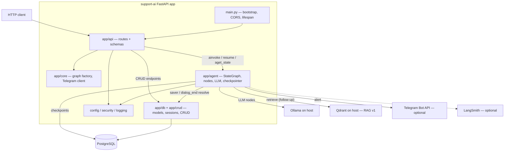
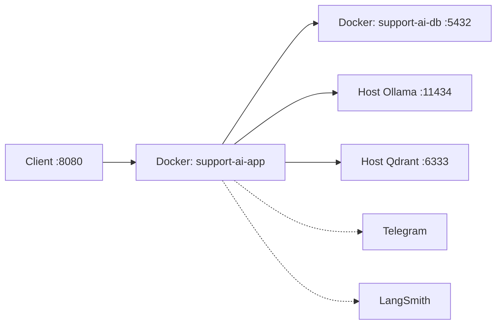

# SupportAI — Project Guide

Onboarding guide for engineers joining this repository. Prefer **code and this guide** over older narrative docs when they conflict.

**Legend:** statements are **facts** from the repository unless marked **Inference** or **Assumption**.

---

## Executive summary

SupportAI is a **Python FastAPI** backend that accepts support incidents over HTTP, runs a **LangGraph** agent to chat with the user and triage the incident (category, priority, tags), optionally escalates via **Telegram** and pauses for **human-in-the-loop (HIL)** confirmation, then persists a **ticket** in **PostgreSQL**. Multi-turn dialog and HIL resume rely on **LangGraph checkpoints** stored in the same Postgres instance. After a ticket exists, follow-up chat can be **RAG-grounded** via **Qdrant** + local embeddings (host Qdrant in v1; not in Compose). LLM inference uses **Ollama** on the host (not containerized by default).

Architectural style: **modular monolith** with a **layered** layout (API → Agent → Data) and **workflow orchestration** inside the agent. Not microservices, not event-driven.

---

## Business purpose

**Problem:** Support incidents arrive as free-text user messages. The system must converse with the user, structure the incident, escalate when urgent/sensitive, and store a durable ticket — without requiring clients to understand LLM or graph internals.

**Core use-case (README):**

1. User submits an incident via API
2. Agent starts chat
3. If no ticket yet → classify, prioritize, tag
4. If critical or high + approval required → alert path (Telegram; README notes alert path may be disabled/misconfigured in practice)
5. Otherwise or after HIL confirmation → save ticket
6. Persist agent state; return HTTP response
7. Follow-up chat continues on the same `thread_id` until the dialog is closed (goodbye / success→`resolved` / escalate / turn-cap). Follow-ups may retrieve from a local knowledge base (RAG) when Qdrant is available.

FastAPI app title/description: **SupportAI API** — automatic ticket processing.

---

## Major capabilities

| Capability | Evidence |
|------------|----------|
| LLM triage (category / priority / tags) | `app/agent/nodes/classifier.py`, `prioritizer.py`, `tagger.py` |
| Multi-turn chat with history | `chat_handler.py`; `POST /tickets/chat/{thread_id}/messages` |
| RAG-grounded follow-up | `app/agent/rag/`; gated in `chat_handler` when `ticket_id` + `category`; optional `source_paths` on `ChatResponse` |
| Dialog close + success resolve | Close helpers in `chat_handler`; `dialog_end` sets ticket `resolved` on success |
| Human-in-the-loop confirmation | `confirmation.py` + `interrupt()`; `POST /tickets/confirm` |
| Critical / sensitive escalation path | `needs_alert()` / `needs_confirmation()`; `alert.py` |
| Ticket CRUD | `GET/PATCH/DELETE /tickets...` via `app/crud/ticket.py` |
| Agent state persistence | `AsyncPostgresSaver` in `checkpointer.py` |
| Input sanitization / injection checks | `app/security/sanitizers.py` (used by agent nodes) |
| Health / readiness / metrics | `app/api/routes/health.py` |
| Optional LangSmith tracing | `app/agent/llm.py` + `LANGSMITH_*` settings |
| Dockerized app + Postgres | `docker-compose.yml` |

---

## Technology stack

| Component | Role |
|-----------|------|
| Python 3.11.9 (README) | Runtime |
| FastAPI + Uvicorn | HTTP API |
| LangGraph | Agent workflow orchestration |
| LangChain ChatOllama | LLM client |
| Ollama + `llama3.1:latest` | Local LLM (host) |
| Qdrant | RAG vector store (host `:6333` in v1; not in Compose) |
| SentenceTransformers (`all-MiniLM-L6-v2`) | Embeddings for ingest + retrieve (384-d) |
| PostgreSQL 18 Alpine | Tickets + LangGraph checkpoints |
| SQLAlchemy async + asyncpg | ORM / DB access |
| Alembic | App schema migrations (`tickets`, `ticket_history`) |
| Pydantic / pydantic-settings | Schemas + config |
| httpx | Telegram Bot API client |
| tenacity | LLM retry wrapper |
| Docker Compose | App + DB deployment |
| pytest (asyncio_mode=auto) | Unit tests |

---

## Runtime startup sequence

### Docker Compose (primary packaged path)

**Fact** (`docker-compose.yml`):

1. Start `db` (Postgres); wait until healthy (`pg_isready`)
2. Start `app`; depends on healthy `db`
3. In `app` container: `alembic upgrade head`
4. Then: `uvicorn app.main:app --host 0.0.0.0 --port 8080 --workers 2`
5. On process start (`app/main.py` lifespan): create engine, `SELECT 1`, yield; on shutdown dispose engine

Ollama is **not** started by Compose (service block commented out). App must reach Ollama via `OLLAMA_BASE_URL` (e.g. `host.docker.internal:11434` from Docker).

### Local uvicorn (README)

1. Configure `.env` for localhost DB/Ollama (and RAG/Qdrant block if using follow-up RAG)
2. Ensure Postgres and Ollama (`llama3.1:latest`) are running
3. For RAG: run host Qdrant, then `python scripts/ingest_rag_docs.py`
4. `uvicorn app.main:app --port=8080 --reload`
5. **Assumption:** migrations must be applied separately if not using Compose’s startup command

Detail: [`docs/feature_rag.md`](feature_rag.md).

### Per-request agent setup (API)

For agent-backed endpoints, routes typically:

1. Open `get_checkpointer(db_url)` (creates checkpoint tables via `setup()` if needed)
2. Optionally open Telegram client context
3. Compile graph with that checkpointer
4. Pass `config["configurable"]` = `{thread_id, session, telegram_client}`
5. `ainvoke` / `Command(resume=...)` / `aget_state`

---

## High-level architecture

**Facts:**

- Single deployable FastAPI application (`app/main.py`)
- Layers: **API** (`app/api`) → **Agent** (`app/agent`) → **Data** (`app/db`, `app/crud`), plus **core** DI and cross-cutting config/security/logging
- Agent is a LangGraph `StateGraph` over `AgentState`
- PostgreSQL holds both **application tables** (Alembic) and **checkpoint tables** (LangGraph saver)

**Inference:** Best described as a modular monolith with layered architecture and embedded workflow engine — not hexagonal in the strict ports/adapters sense (concrete dependencies wired via FastAPI `Depends` and graph `config`).

### Mermaid — logical architecture



### Mermaid — deployment topology



---

## Major subsystems and responsibilities

### 1. API layer (`app/api/`) — HTTP boundary

- Validate requests (Pydantic schemas)
- Invoke agent (create / chat / confirm) or CRUD (get / list / patch / delete)
- Map interrupts/errors to HTTP status codes
- Health / readiness / metrics

**Does not own:** triage rules, SQL details, LLM prompts.

### 2. Agent / workflow engine (`app/agent/`) — **central**

- Chat reply + message history
- Classify → prioritize → tag
- Alert + HIL confirmation + save
- Follow-up RAG retrieve + grounded prompts (`app/agent/rag/`, gated in `chat_handler`)
- Dialog close paths; success close resolves ticket in `dialog_end`
- Routing (`graph.py`) and shared state (`AgentState`)
- Checkpoints, LLM client, retries

**Public Python surface:** `build_agent_graph()`, `AgentState`, `get_checkpointer()`, nodes as graph steps. Runtime ops used by API: `ainvoke`, `aget_state`, `Command(resume=...)`.

### 3. Data layer (`app/db/`, `app/crud/`)

- ORM models: `Ticket`, `TicketHistory`, enums
- Async engine/session (`get_db_session`)
- CRUD helpers used by API and saver
- Alembic migrations for app tables

**Does not own:** checkpoint schema (agent checkpointer).

### 4. Core (`app/core/dependencies.py`)

- Cached `get_agent_graph()` → `build_agent_graph`
- Telegram `httpx` client helpers

### 5. Cross-cutting

| Module | Role |
|--------|------|
| `app/config.py` | Settings from `.env` |
| `app/security/sanitizers.py` | Length / sanitize / injection checks |
| `app/logging_config.py` | Structured logging |
| `app/main.py` | App factory, CORS, router mount |

### Central vs supporting

| Central | Supporting |
|---------|------------|
| Agent workflow | Ollama, Telegram, LangSmith, Qdrant (RAG) |
| Tickets API (create/chat/confirm) | Health endpoints |
| PostgreSQL (tickets + checkpoints) | Alembic tooling, Docker; host Qdrant for RAG |

---

## Request lifecycle

### A. New incident — `POST /tickets/`

1. Validate `TicketCreate` (`thread_id`, `user_input`, …)
2. Build `AgentState(thread_id, user_input)` for a **new** thread (full model OK; no prior checkpoint)
3. Open checkpointer + Telegram client; compile graph
4. If checkpoint already exists → **409** (use chat endpoint)
5. `ainvoke` → always starts at **chat**, then triage if no `ticket_id`
6. Graph: `chat → classifier → prioritizer → tagger → (alert?) → (confirmation?) → saver`
7. If `__interrupt__` → **201** with `status=awaiting_confirmation`, `id=0` (no DB ticket yet)
8. Else require `ticket_id`; load ticket via CRUD; return `TicketResponse` (+ `last_response`, `messages_count`)
9. Agent errors without `ticket_id` (except `alert_failed`) → **500**

### B. Follow-up chat — `POST /tickets/chat/{thread_id}/messages`

1. Load checkpoint; **404** if missing; **400** if `dialog_closed` or HIL pending
2. `ainvoke` with **partial** state: `AgentState(...).model_dump(exclude_unset=True)` so Pydantic defaults do not overwrite checkpoint fields (e.g. `followup_turn_count`)
3. `chat` runs: close detection → turn budget → optional RAG retrieve (`ticket_id` + `category`) → LLM
4. `route_after_chat` → `dialog_end` if `ticket_id` set (no re-triage); on `close_reason=success`, `dialog_end` sets ticket `status=resolved`
5. Return `ChatResponse` (optional `source_paths` from `rag_source_paths`)

**Close paths (fact):** escalate / success / goodbye / turn_cap — see [`feature_rag.md`](feature_rag.md). Only **success** updates ticket status.

### C. HIL resume — `POST /tickets/confirm`

1. Require `snapshot.interrupts`
2. `ainvoke(Command(resume=yes|no))`
3. Approved → saver; rejected → end without save
4. Return `ConfirmResponse`

### D. Plain CRUD

`GET/PATCH/DELETE` by ticket id (and list by `thread_id`) — no agent.

### Agent routing (authoritative: `graph.py`)

```text
START → chat
  → dialog_end → END    if ticket_id is set (follow-up; may resolve on success)
  → end                 if dialog_closed and no ticket_id
  → classifier → prioritizer → tagger
       → alert if needs_alert OR needs_confirmation
       → saver otherwise
  alert → confirmation if needs_confirmation else saver
  confirmation → end if confirmed is False else saver
  saver → END
```

**Invariant:** `route_after_chat` checks **`ticket_id` before `dialog_closed`** so success-close on follow-up still reaches async `dialog_end`.

`needs_alert`: priority == critical and not alert_sent.
`needs_confirmation`: priority == high and requires_approval and confirmed is None.
`requires_approval`: set in prioritizer when sensitive keywords appear (e.g. удалить, delete, refund, reset).

---

## Important business entities

| Entity | Meaning | Storage |
|--------|---------|---------|
| **Ticket** | Durable support incident | `tickets` table |
| **thread_id** | Client session key (max 64 chars) | Ticket column + LangGraph checkpoint key |
| **AgentState** | In-flight workflow context | Checkpoints (+ returned from `ainvoke`) |
| **Category** | `technical \| billing \| feature \| other` | Ticket + state |
| **Priority** | `low \| medium \| high \| critical` | Ticket enum + state |
| **Tags** | Free-form labels | Postgres `ARRAY` |
| **Status** | `new \| in_progress \| resolved \| closed` | Ticket enum |
| **awaiting_confirmation** | API-only status during HIL | **Not** a DB enum value |
| **messages** | Chat transcript | Agent state / checkpoints |
| **TicketHistory** | Audit events (`event_type`, old/new value) | `ticket_history` |
| **requires_approval / confirmed** | HIL flags | Agent state |
| **dialog_closed** | User/agent ended chat (goodbye / success / escalate / turn_cap) | Agent state |
| **close_reason** | `goodbye \| success \| escalate \| turn_cap` | Agent state |
| **followup_turn_count** | Follow-up messages after ticket exists (N-cap) | Agent state |
| **rag_source_paths / rag_used** | Last retrieve citations + flag | Agent state → optional API `source_paths` |

**Two Postgres roles:**

1. Application data — Alembic (`tickets`, `ticket_history`)
2. Agent session data — LangGraph checkpoint tables via `AsyncPostgresSaver.setup()`

Until `saver` completes, triage may exist only in the checkpoint (HIL case returns `id=0`).

---

## Directory guide

```text
support-ai/
├── app/
│   ├── main.py                 # FastAPI app, CORS, lifespan
│   ├── config.py               # Settings (.env)
│   ├── logging_config.py
│   ├── api/
│   │   ├── routes/tickets.py   # Business HTTP surface
│   │   ├── routes/health.py
│   │   └── schemas/ticket.py   # Request/response contracts
│   ├── core/dependencies.py    # Graph factory, Telegram client
│   ├── agent/
│   │   ├── graph.py            # StateGraph wiring + routing
│   │   ├── state.py            # AgentState
│   │   ├── checkpointer.py
│   │   ├── llm.py
│   │   ├── retry.py
│   │   ├── rag/                # embeddings + Qdrant retriever
│   │   └── nodes/              # chat, classify, prioritize, tag, alert, confirm, save, dialog_end
│   ├── crud/ticket.py
│   ├── db/                     # base, session, models
│   └── security/sanitizers.py
├── alembic/                    # App schema migrations
├── data/rag_docs/              # Fake KB corpus by category (RAG ingest)
├── tests/                      # pytest unit tests (mocked LLM / Qdrant)
├── scripts/                    # ingest_rag_docs, eval_rag, other helpers
├── docs/                       # PROJECT_GUIDE, feature_rag, architecture.md (partially stale)
├── docker-compose.yml
├── Dockerfile
├── requirements.txt
├── pytest.ini
├── .env.example
└── README.md                   # Runbook + curl examples
```

---

## Important files to understand first

| Order | File | Why |
|------:|------|-----|
| 1 | `README.md` | Business flow + curl examples |
| 2 | `app/agent/state.py` | Shared workflow vocabulary |
| 3 | `app/agent/graph.py` | Routing truth |
| 4 | `app/api/routes/tickets.py` | How HTTP drives the agent |
| 5 | `app/api/schemas/ticket.py` | Client contracts |
| 6 | `app/db/models/ticket.py` | Durable ticket shape |
| 7 | `app/crud/ticket.py` | Persistence API |
| 8 | `app/agent/nodes/chat_handler.py` | Chat start, close detection, RAG gate, turn budget |
| 9 | `app/agent/nodes/dialog_end.py` | Success close → ticket `resolved` |
| 10 | `app/agent/rag/` | Embeddings + Qdrant retrieve |
| 11 | `app/agent/nodes/saver.py` | How tickets get written + initial status |
| 12 | `app/agent/checkpointer.py` | Session persistence |
| 13 | `app/config.py` + `.env.example` | Runtime configuration (incl. RAG) |
| 14 | `docs/feature_rag.md` | RAG ops + E2E curls |
| 15 | `docker-compose.yml` | Deploy topology |

---

## External systems and integrations

| System | Required? | Integration point |
|--------|-----------|-------------------|
| PostgreSQL | Yes | SQLAlchemy + LangGraph checkpointer |
| Ollama | Yes for agent LLM paths | `ChatOllama` in `llm.py` |
| Qdrant | Optional for RAG follow-up | `app/agent/rag/retriever.py`; ingest via `scripts/ingest_rag_docs.py` |
| Telegram Bot API | Optional | `alert.py` via `telegram_client`; missing config → `alert_failed` (non-fatal for create if ticket still saved) |
| LangSmith | Optional | Env vars set in `llm.py` when `LANGSMITH_TRACING` |
| HuggingFace / MiniLM | First RAG embed download | `sentence-transformers` model from Settings |

No first-party frontend ships in this repo. CORS defaults allow `localhost:3000` / `8080` (**Inference:** anticipates a separate web client).

---

## Configuration and deployment overview

### Configuration

- Loaded by `pydantic-settings` from environment / `.env` (`app/config.py`)
- Template: `.env.example`
- Important groups: `DATABASE_URL`, Ollama (`OLLAMA_BASE_URL`, `LLM_MODEL`, …), RAG (`QDRANT_*`, `RAG_*`), `SECRET_KEY`, Telegram, LangSmith, CORS, `APP_ENV`

**Local vs Docker (README / `.env.example`):**

| Setting | Local | Docker app container |
|---------|-------|----------------------|
| `DATABASE_URL` host | `localhost` | `db` |
| `OLLAMA_BASE_URL` | `http://localhost:11434` | `http://host.docker.internal:11434` |
| `QDRANT_URL` | `http://localhost:6333` | **Inference:** would use host/service hostname when Compose Qdrant is added (not v1) |
| `APP_ENV` | often `dev` | example suggests `prod` |

### Deployment notes

- Compose network: `support-ai-net`; volume: `postgres-data`
- App port **8080**; DB **5432** published for host debugging
- Migrations run automatically in Compose `command` before uvicorn

### Config fields present but unused in `app/` (fact as of analysis)

- `RATE_LIMIT_PER_MINUTE` — defined in Settings; no usage found under `app/`
- `SECRET_KEY` — required by Settings; no usage found under `app/`
- `.env.example` `ALERT_PRIORITY_THRESHOLD` — not a field on `Settings` (extra env ignored)

**Inference:** reserved for future auth/rate-limiting/alert tuning.

---

## Testing strategy

**Facts:**

- `pytest.ini`: `asyncio_mode = auto`, tests under `tests/`
- Test modules:
  - `tests/test_chat_history.py` — `chat_handler`, routing, turn budget, gated RAG (mocked), `ChatResponse.source_paths`
  - `tests/test_dialog_close.py` — goodbye / success / escalate detection
  - `tests/test_dialog_end.py` — success → `resolved` (mocked CRUD)
  - `tests/test_rag_retriever.py` — Qdrant retrieve (mocked client/embedder)
  - `tests/test_critical.py` — sanitizers, retry, classifier fallbacks (mocked LLM)
- README + [`feature_rag.md`](feature_rag.md) document **manual** curl scenarios (HIL, multiturn, RAG A/B/C)
- Optional offline eval: `python scripts/eval_rag.py` (not default pytest; needs Qdrant ± Ollama)

**Inference:** Automated coverage is unit-level around security and selected agent/RAG nodes; there is little/no end-to-end API + real Ollama + Postgres + Qdrant integration suite in `tests/`. Use README / feature_rag curls for full-path verification.

**How to run:**

```bash
pytest tests/ -v
# or
pytest tests/test_chat_history.py -v
```

---

## Glossary

| Term | Definition |
|------|------------|
| **Ticket** | Persisted support incident row |
| **thread_id** | Session identifier shared by API, ticket, and checkpoints |
| **AgentState** | LangGraph state object for one session’s workflow |
| **Node** | One step function in the LangGraph graph |
| **Checkpointer** | Postgres-backed store for graph state between HTTP calls |
| **HIL** | Human-in-the-loop; graph `interrupt()` until confirm |
| **Triage** | Classify + prioritize + tag pipeline |
| **awaiting_confirmation** | HTTP response status while HIL is pending (not DB status) |
| **dialog_closed** | Conversation ended (goodbye / success / escalate / turn_cap) |
| **close_reason** | Why the dialog closed |
| **RAG** | Retrieve-augmented generation on follow-up chat |
| **followup_turn_count** | Count of post-ticket chat turns toward N-cap |
| **source_paths** | Optional citation paths on `ChatResponse` |
| **requires_approval** | Sensitive-action flag from prioritizer keywords |
| **saver** | Node that writes the ticket via CRUD |
| **dialog_end** | Follow-up exit node; resolves ticket on success close |
| **CRUD** | Direct DB access helpers in `app/crud/ticket.py` |

---

## Recommended reading order for new engineers

1. **Business purpose** — this guide § Business purpose + README core use-case
2. **Architecture map** — this guide § High-level architecture
3. **Agent** — `state.py` → `graph.py` → skim `nodes/`
4. **API** — `schemas/ticket.py` → `routes/tickets.py` (create, chat, confirm, then CRUD)
5. **Data** — `models/ticket.py` → `crud/ticket.py` → `session.py` → `saver.py`
6. **Cross-cutting** — `config.py`, `sanitizers.py`, `dependencies.py`
7. **Run locally** — README + `.env.example` + Compose; Qdrant + ingest if testing RAG
8. **Verify** — README HIL + multiturn curls; [`feature_rag.md`](feature_rag.md) scenarios A–C; skim `tests/`
9. **Deepen** — prompts in classifier/prioritizer/tagger; RAG prompts in `chat_handler`; retry; alert failure behavior

---

## Architectural assumptions and areas of uncertainty

### Document freshness

| Source | Trust for |
|--------|-----------|
| `app/agent/graph.py` + README mermaid | Current workflow (chat, HIL, follow-up, `dialog_end`) |
| `docs/feature_rag.md` | RAG ops, close paths, E2E curls |
| `docs/implementation_plan_rag.md` | Step history for RAG v1 |
| `docs/architecture.md` | Layers + deployment sketch |
| `docs/architecture.md` LangGraph state diagram | **Stale** — omits chat, confirmation, `dialog_end` routing |

Prefer **code** over `docs/architecture.md` for workflow details.

### Assumptions / inferences

1. **Inference:** Product is API-first; no UI in-repo.
2. **Inference:** One `thread_id` is intended as one conversation; `thread_id` is indexed but not unique on `tickets` — multiple tickets per thread are schema-possible.
3. **Fact:** README says Telegram alert is “currently disabled” in the business narrative; **code still routes through `alert`** when `needs_alert` / confirmation path applies — behavior depends on Telegram env being set.
4. **Fact:** Create path treats `alert_failed` as non-blocking if a ticket was still saved.
5. **Assumption:** Production expects Compose + host Ollama unless Ollama is wired differently.
6. **Uncertainty:** Whether `RATE_LIMIT_PER_MINUTE` / `SECRET_KEY` will be enforced soon — unused in `app/` today.
7. **Uncertainty:** Full production observability beyond JSON logs + optional LangSmith is not specified in-repo.
8. **Fact:** `TicketCreate` is shared by API validation and saver→CRUD — layering is pragmatic, not strict clean architecture.
9. **Fact:** Some CRUD methods (`update_ticket`, `delete_ticket`) call `session.commit()` internally while `get_db_session` also commits on success — worth care when debugging transactions.
10. **Fact:** Health metrics key `tickets_24h` counts all tickets; 24h filter is commented out in `health.py`.
11. **Fact:** Follow-up `ainvoke` must use `model_dump(exclude_unset=True)` (or equivalent partial dict). Passing a full `AgentState(...)` with defaults overwrites checkpointed `followup_turn_count` / flags and breaks N-cap.
12. **Fact:** Qdrant is **not** in Compose for RAG v1; host process + Settings `QDRANT_URL`.

### Security note

Agent nodes apply sanitizers; API also constrains lengths via Pydantic. This is defense-in-depth, not a full auth model — no user authentication layer found in routes (**Inference:** internal/demo or trusted-network deployment unless added later).

---

## Quick API reference

| Method | Path | Agent? |
|--------|------|--------|
| `POST` | `/tickets/` | Yes |
| `POST` | `/tickets/chat/{thread_id}/messages` | Yes |
| `GET` | `/tickets/chat/{thread_id}` | Checkpoint read |
| `POST` | `/tickets/confirm` | Resume |
| `DELETE` | `/tickets/{thread_id}/confirm` | Deletes checkpoint |
| `GET` | `/tickets/{id}` | No |
| `GET` | `/tickets/?thread_id=` | No |
| `PATCH` | `/tickets/{id}` | No |
| `DELETE` | `/tickets/{id}` | No |
| `GET` | `/health/`, `/health/ready`, `/health/metrics` | No |
| `GET` | `/` | Info + docs links |

Interactive docs: `/docs`, `/redoc`.

---

*Generated from repository analysis for engineer onboarding. When behavior disagrees with prose, trust the code paths cited above.*
