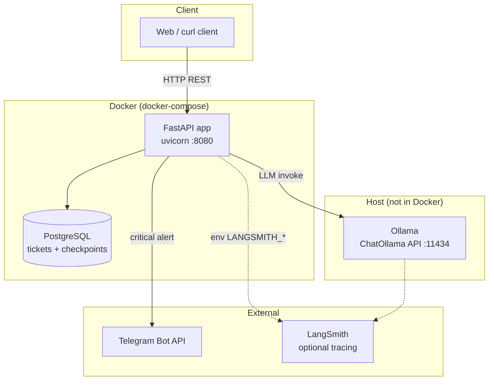
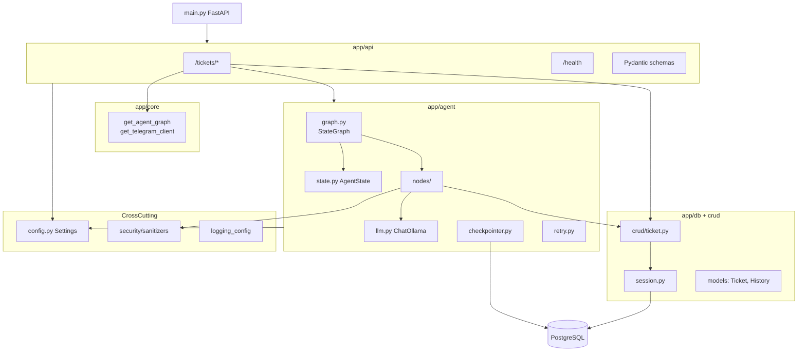
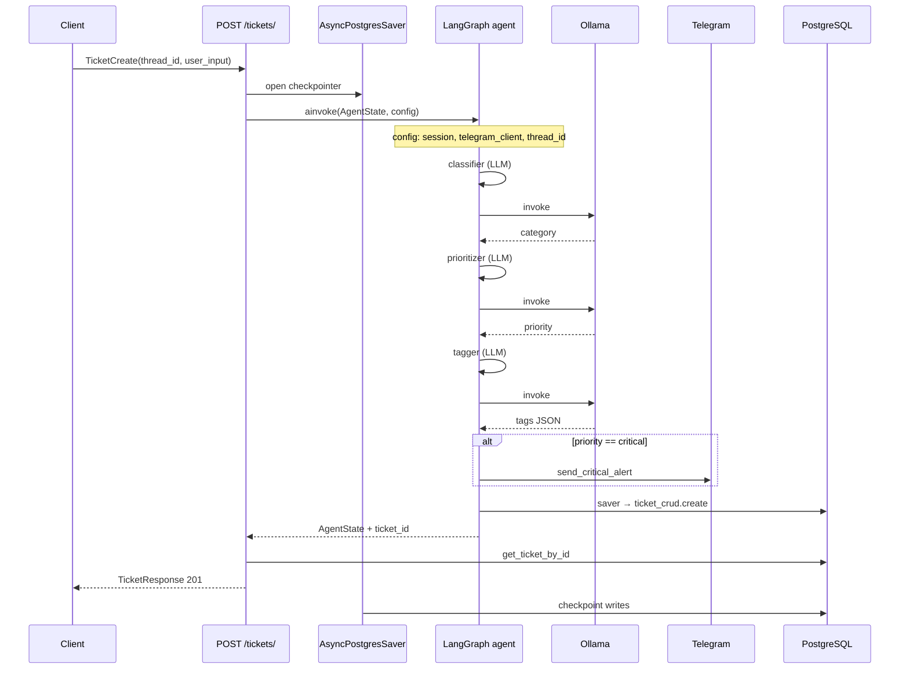
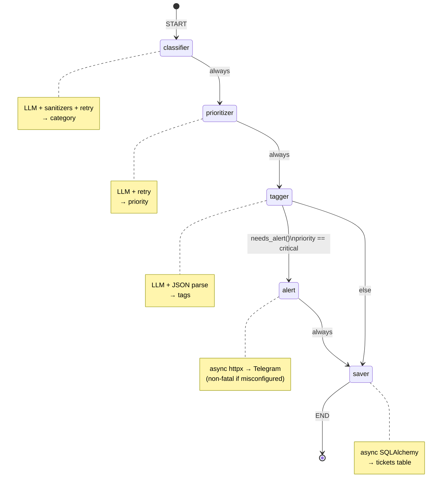
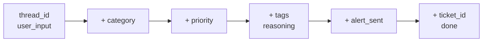

# SupportAI — Architecture

LangGraph-based support ticket processing API. A user submits an incident via HTTP; the agent classifies it, sets priority and tags, optionally sends a Telegram alert for critical cases, and persists the ticket to PostgreSQL.

## Tech stack

| Component | Role |
|-----------|------|
| **FastAPI** | REST API; `POST /tickets/` runs the agent |
| **LangGraph** | Orchestrates nodes with conditional routing |
| **Ollama** | Local LLM (`ChatOllama`) for classify / prioritize / tag |
| **PostgreSQL** | Tickets + LangGraph checkpoint tables |
| **Telegram** | Optional alert for `critical` priority |
| **LangSmith** | Optional tracing via env vars in `llm.py` |
| **Docker** | App + Postgres (`docker-compose`); Ollama runs on the host |

---

## System overview (runtime)



---

## Application layers



---

## Ticket creation flow



---

## LangGraph agent (nodes & routing)

Linear chain: **classifier → prioritizer → tagger**.

Branch: **tagger → alert** when `priority == "critical"` and alert not sent yet; otherwise **tagger → saver**. **alert** always continues to **saver**.



---

## AgentState through the pipeline



Errors are stored on `error`. Validation or injection failures in classifier/tagger short-circuit with safe defaults (e.g. `category: other`).

---

## Repository layout

```text
support-ai/
├── app/
│   ├── main.py              # FastAPI app, CORS, lifespan
│   ├── config.py            # Settings (.env)
│   ├── api/routes/          # tickets, health
│   ├── core/dependencies.py # graph builder, Telegram client
│   ├── agent/
│   │   ├── graph.py         # StateGraph wiring
│   │   ├── state.py         # AgentState
│   │   ├── llm.py           # ChatOllama singleton
│   │   ├── checkpointer.py  # LangGraph Postgres checkpoints
│   │   ├── retry.py         # tenacity on LLM calls
│   │   └── nodes/           # classifier, prioritizer, tagger, alert, saver
│   ├── crud/ticket.py
│   ├── db/                  # SQLAlchemy models, session
│   └── security/sanitizers.py
├── alembic/                 # DB migrations
├── tests/
├── docs/
│   └── architecture.md      # this file
└── docker-compose.yml       # app + postgres (Ollama on host)
```

---

## API endpoints

| Method | Path | Description |
|--------|------|-------------|
| `POST` | `/tickets/` | Create ticket via agent pipeline |
| `GET` | `/tickets/` | List tickets by `thread_id` |
| `GET` | `/tickets/{id}` | Get ticket by id |
| `PATCH` | `/tickets/{id}` | Partial update |
| `DELETE` | `/tickets/{id}` | Delete ticket |
| `GET` | `/health` | Health check |
| `GET` | `/` | API info + docs links |
