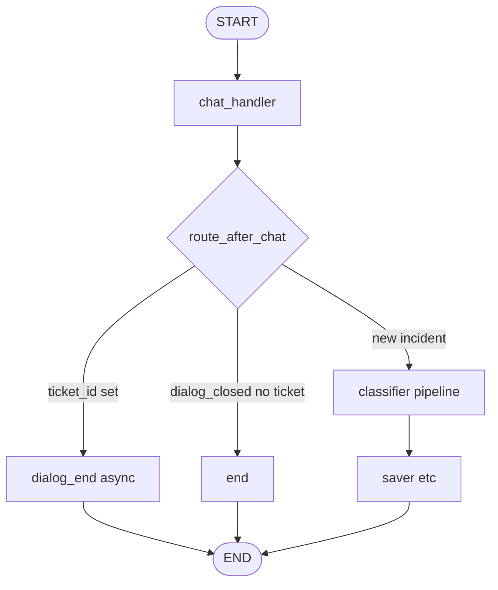
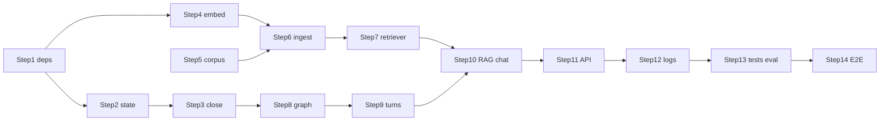

# RAG Follow-up Dialog — Step-by-Step Implementation Plan

Incremental implementation guide for the RAG follow-up feature.

**Related docs:** [feature_rag.md](feature_rag.md) (decisions), [PROJECT_GUIDE.md](PROJECT_GUIDE.md) (architecture), `.cursor/rules/contribution.mdc` (repo conventions).

**Prerequisites for E2E (Step 14):** App on `:8080`, Postgres, Ollama, Qdrant on `:6333`, ingest completed.

---

## Target behavior (v1)



**Follow-up path inside `chat_handler` (gated):**
- Run only when `ticket_id` and `category` are set.
- Increment `followup_turn_count` on each follow-up; if above `RAG_MAX_FOLLOWUP_TURNS` → N-cap close (no LLM).
- Retrieve from Qdrant (category payload filter; query = user message + tags).
- Build grounded prompt; on failure/empty → ungrounded fallback + log.
- Detect close reason: goodbye | success | escalate | turn_cap.
- Set `dialog_closed` and `close_reason` in returned state.

**Async `dialog_end` node** (mirrors `app/agent/nodes/saver.py`):
- Read `session` from `config["configurable"]`.
- If `close_reason == "success"` → `update_ticket(status=resolved)` + optional history.
- Always edges to `END`.

**Routing invariant:** `route_after_chat` must check **`ticket_id` before `dialog_closed`** so success-close on follow-up reaches `dialog_end` for DB resolve.

---

## Locked constants (v1)

| Constant | Value |
|----------|-------|
| Collection | `support_ai_kb` |
| Vector size | 384 (MiniLM) |
| Distance | Cosine |
| Chunk size | ~400–500 chars, overlap 50 |
| Top-k | 3 |
| Docs root | `data/rag_docs/` |
| Max follow-up turns | `RAG_MAX_FOLLOWUP_TURNS=2` (default) |
| Qdrant URL | `http://localhost:6333` (v1) |
| Embed model | `all-MiniLM-L6-v2` |

### Step 1 env block (add to `.env.example` and `.env`)

```env
# === RAG / Qdrant ===
QDRANT_URL=http://localhost:6333
QDRANT_COLLECTION=support_ai_kb
RAG_TOP_K=3
RAG_EMBED_MODEL=all-MiniLM-L6-v2
RAG_MAX_FOLLOWUP_TURNS=2
RAG_DOCS_PATH=data/rag_docs
```

---

## Close detection (locked)

Rework `app/agent/nodes/chat_handler.py` — **remove `"спасибо"` from goodbye logic**:

| Helper | Triggers | `dialog_closed` | Ticket status |
|--------|----------|-----------------|---------------|
| `_is_goodbye_message` | `GOODBYE_WORDS` only (`пока`, `до свидания`) | yes | unchanged |
| `_is_success_close` | Normalized strip; `спасибо`, `помогло`, or both; exclude if `?` or length > ~40 | yes | `resolved` (via `dialog_end`) |
| `_is_escalate_message` | Keywords: `оператор`, `поддержк`, `не помог`, `перезвоните`, `связаться с`, `живой человек` | yes | unchanged |
| Turn cap | `followup_turn_count > RAG_MAX_FOLLOWUP_TURNS` | yes | unchanged |

**Examples:**
- `"Спасибо, пока!"` → goodbye, not success.
- `"Спасибо, помогло!"` → success close.
- `"Спасибо, а пароль?"` → normal chat (excluded).

**Detection order:** escalate → success → goodbye → turn-cap (before LLM) → RAG/normal chat.

---

## Step-by-step implementation

Each step is independently reviewable. **Run the verification scenario before moving on.**

---

### Step 1 — Dependencies and configuration (no runtime behavior change)

**Goal:** Wire settings and deps without touching agent logic.

**Actions:**
- Uncomment/add `qdrant-client`, `sentence-transformers` in `requirements.txt`; `pip install -r requirements.txt`.
- Add to `app/config.py`: `QDRANT_URL`, `QDRANT_COLLECTION`, `RAG_TOP_K`, `RAG_EMBED_MODEL`, `RAG_MAX_FOLLOWUP_TURNS` (default **2**), `RAG_DOCS_PATH`.
- Mirror vars in **`.env.example` and `.env`** (update the config you actually run with locally).

**Verification scenario:**
```bash
pytest tests/ -v
python -c "from app.config import get_settings; s=get_settings(); assert s.RAG_MAX_FOLLOWUP_TURNS == 2; print('RAG config OK', s.QDRANT_URL)"
```
- All tests green.
- Settings load from `.env` without validation errors.
- App starts: `uvicorn app.main:app --port 8080` (or existing run path).
- No agent code reads RAG settings yet (behavior unchanged).

---

### Step 2 — Extend `AgentState` (backward compatible)

**Goal:** Add checkpoint fields with safe defaults; no behavior change yet.

**Actions:**
- Add to `app/agent/state.py`: `followup_turn_count=0`, `close_reason=None`, `rag_source_paths=None`, `rag_used=False`.

**Verification scenario:**
```bash
pytest tests/ -v
python -c "from app.agent.state import AgentState; s=AgentState(thread_id='t', user_input='x'); assert s.followup_turn_count == 0"
```
- Existing multiturn curl still works; checkpoint fields serialize with defaults.

---

### Step 3 — Close detection helpers (no RAG, no graph change)

**Goal:** Lock goodbye vs success vs escalate paths (see Close detection above).

**Actions:**
- In `app/agent/nodes/chat_handler.py`:
  - Simplify `_is_goodbye_message` → `GOODBYE_WORDS` only.
  - Add `_is_success_close`, `_is_escalate_message`, `_normalize_user_message`.
  - Set `close_reason` + `dialog_closed` when matched (no DB resolve yet).
- Add `tests/test_dialog_close.py`.
- Update `tests/test_chat_history.py`: success-close expects `dialog_closed`; add `"Спасибо, пока!"` goodbye case.

**Verification scenario:**
```bash
pytest tests/test_dialog_close.py tests/test_chat_history.py -v
```
- `"Спасибо, помогло!"` → `dialog_closed=True`, `close_reason=success` (no `resolved` in DB yet).
- `"Спасибо, пока!"` → goodbye only.
- `"Хочу оператора"` → escalate close.

---

### Step 4 — Embedding module

**Goal:** Shared embedder for ingest and runtime.

**Actions:**
- Create `app/agent/rag/__init__.py`, `app/agent/rag/embeddings.py`.
- Lazy cached `SentenceTransformer` using `RAG_EMBED_MODEL`.
- Expose `embed_texts(list[str]) -> list[list[float]]`.

**Verification scenario:**
```bash
python -c "from app.agent.rag.embeddings import embed_texts; v=embed_texts(['тест'])[0]; assert len(v)==384; print('embed dim', len(v))"
```
- Returns 384-d vector (requires HF model download on first run).
- Not included in default `pytest` (no live model in CI unit suite).

---

### Step 5 — Fake document corpus

**Goal:** Runnable knowledge base for dev/eval.

**Actions:**
- Create `data/rag_docs/technical/`, `billing/`, `feature/`, `other/`.
- Add ~3–5 short **descriptively named** `.md` files per category (e.g. `technical/login_error_401.md`).

**Verification scenario:**
```bash
# PowerShell
Get-ChildItem -Recurse data/rag_docs -Filter *.md | Group-Object { $_.Directory.Name }
```
- Four category folders present; each file name reflects content.
- Folder names match classifier literals: `technical`, `billing`, `feature`, `other`.

---

### Step 6 — Ingest script

**Goal:** Populate Qdrant from local corpus.

**Actions:**
- Implement `scripts/ingest_rag_docs.py`:
  - Walk `RAG_DOCS_PATH`; infer `category` from parent folder.
  - Validate; chunk via `langchain-text-splitters`.
  - Embed via `app/agent/rag/embeddings.py`.
  - Upsert to `support_ai_kb`; payload `{category, source_path, text}`; point id = hash(`source_path` + chunk index).
  - Idempotent re-run.

**Verification scenario:**
```bash
# Qdrant must be running
python scripts/ingest_rag_docs.py
python scripts/ingest_rag_docs.py   # second run: no duplicates / stable counts
```
- Script exits 0; logs point count > 0.
- Qdrant collection `support_ai_kb` exists with payload `category` filterable.

---

### Step 7 — Retriever module + tests

**Goal:** Runtime search with graceful fallback.

**Actions:**
- Implement `app/agent/rag/retriever.py`:
  - Spike `langchain-qdrant` with payload filter; fall back to `qdrant-client` if needed.
  - `retrieve(query_text, category, top_k) -> list[RagChunk]`.
  - try/except → empty list + `logger.warning`.
- Add `tests/test_rag_retriever.py` (mocked Qdrant/embedder).

**Verification scenario:**
```bash
pytest tests/test_rag_retriever.py -v
python -c "from app.agent.rag.retriever import retrieve; r=retrieve('ошибка 401 пароль', 'technical', 3); print(len(r), [c.source_path for c in r[:2]])"
```
- Unit tests pass (mocked).
- Optional live smoke after ingest returns ≥1 hit for a technical login query.

---

### Step 8 — Graph routing fix + async `dialog_end` (resolve on success)

**Goal:** Success-close writes `resolved` to DB; routing allows it.

**Actions:**
- Create `app/agent/nodes/dialog_end.py` (async), mirroring `saver.py`:
  - If `close_reason == "success"` and `ticket_id`: `update_ticket(status=resolved)` + optional `add_ticket_history`.
- Update `app/agent/graph.py`:
  - Replace inline no-op with `dialog_end` from new module.
  - **Fix `route_after_chat`:** `ticket_id` → `dialog_end` **first**; then `dialog_closed` → `end`; else `classifier`.
  - Keep `dialog_end → END` edge.
- Add `tests/test_dialog_end.py`; extend routing tests.

**Verification scenario:**
```bash
pytest tests/test_dialog_end.py tests/test_chat_history.py::TestRouteAfterChat -v
```
- Mocked test: success-close state → `update_ticket` called with `status=resolved`.
- Routing test: follow-up with `ticket_id` + `dialog_closed` routes to `dialog_end`, not `end`.

---

### Step 9 — Follow-up turn budget

**Goal:** Hard cap at `RAG_MAX_FOLLOWUP_TURNS=2`.

**Actions:**
- In `chat_handler.py`, when `ticket_id` set (follow-up):
  - Increment `followup_turn_count` in returned state.
  - If `followup_turn_count > RAG_MAX_FOLLOWUP_TURNS`: `close_reason=turn_cap`, `dialog_closed=True`, fixed Russian message, skip LLM.
- Add tests: follow-ups 1–2 proceed; 3rd triggers cap.

**Verification scenario:**
```bash
pytest tests/test_chat_history.py -v -k "turn_cap or followup"
```
- With `RAG_MAX_FOLLOWUP_TURNS=2`: 3rd follow-up message returns cap message, `done=true`, no LLM call (mocked).

---

### Step 10 — Gated RAG in `chat_handler`

**Goal:** Grounded follow-up prompts when Qdrant has hits.

**Actions:**
- Gate: `ticket_id` and `category` → retriever with query = user message + tags.
- Add `_build_rag_prompt(...)`; fallback to `_build_chat_prompt`.
- Store `rag_source_paths`, `rag_used=True` on hits.
- Missing `category` with `ticket_id`: skip RAG + log, ungrounded chat.

**Verification scenario:**
```bash
pytest tests/test_chat_history.py tests/test_rag_retriever.py -v
```
- Mocked: prompt contains retrieved doc block when hits exist.
- Mocked: create path (`ticket_id=None`) never calls retriever.
- Mocked: empty retrieval → ungrounded prompt, warning logged.

---

### Step 11 — API `source_paths`

**Goal:** Expose citation paths to clients (additive).

**Actions:**
- Add `source_paths: list[str] | None = None` to `ChatResponse` in `app/api/schemas/ticket.py`.
- Map `rag_source_paths` in `app/api/routes/tickets.py` for chat POST and GET history.

**Verification scenario:**
```bash
curl.exe -s http://localhost:8080/openapi.json | findstr source_paths
pytest tests/ -v
```
- OpenAPI schema lists optional `source_paths`.
- Existing responses without RAG omit field or return `null`.

---

### Step 12 — Structured logging

**Goal:** Observability for RAG and close paths.

**Actions:**
- Log with `[{thread_id}]`: `rag_used`, hit count, fallback reason, `close_reason`, `followup_turn_count`, source path count.
- Warning on RAG skip/failure; info on success resolve in `dialog_end`.

**Verification scenario:**
- Run one follow-up curl (Scenario A below); app logs contain `[thread_id]` RAG fields.
- Trigger empty-store fallback (stop Qdrant); log contains warning, chat still returns 200.

---

### Step 13 — Remaining tests + offline eval

**Goal:** Full regression + optional quality check.

**Actions:**
- Run full `pytest tests/ -v` (mocked; no live Qdrant/Ollama).
- Add `scripts/eval_rag.py` using `ragas` + fake docs (manual/CI optional; not default pytest).

**Verification scenario:**
```bash
pytest tests/ -v
python scripts/eval_rag.py
```
- All unit tests green without live external services.
- Eval script runs when Qdrant + corpus loaded (optional gate).

---

### Step 14 — Manual E2E + docs

**Goal:** Confirm end-to-end product flow with runnable curls.

**Actions:**
- Start Qdrant; run ingest; ensure `.env` RAG block matches Step 1.
- Run the three scenarios below (use **fresh `thread_id` per scenario**).
- Update `docs/feature_rag.md` / README for Qdrant, ingest, env vars.

**Verification scenario:** All three scenarios pass their **Expected** checks.

---

## Step 14 — E2E curl scenarios (runnable)

Use PowerShell / `curl.exe` as in [README.md](../README.md). Replace `{TICKET_ID}` with `id` from create response.

**Assumptions:** `RAG_MAX_FOLLOWUP_TURNS=2`, ingest loaded, technical docs include login/401 content.

---

### Scenario A — Success close → `resolved` + RAG `source_paths`

**Flow:** create → 2 follow-ups (check `source_paths`) → `"Спасибо, помогло!"` → verify ticket + chat.

```powershell
# A1 — Create ticket (technical login → RAG category filter)
curl.exe -X POST "http://localhost:8080/tickets/" `
  -H "Content-Type: application/json" `
  -d '{"thread_id":"rag_success_001","user_input":"Не могу войти в аккаунт, ошибка 401"}'

# Note TICKET_ID from response (e.g. 12)

# A2 — Follow-up 1 (expect source_paths when RAG hits)
curl.exe -X POST "http://localhost:8080/tickets/chat/rag_success_001/messages" `
  -H "Content-Type: application/json" `
  -d '{"content":"Ошибка 401 при вводе пароля"}'

# A3 — Follow-up 2 (still within turn budget)
curl.exe -X POST "http://localhost:8080/tickets/chat/rag_success_001/messages" `
  -H "Content-Type: application/json" `
  -d '{"content":"Пробовал сброс пароля, не помогло"}'

# A4 — Success close
curl.exe -X POST "http://localhost:8080/tickets/chat/rag_success_001/messages" `
  -H "Content-Type: application/json" `
  -d '{"content":"Спасибо, помогло!"}'

# A5 — Chat state
curl.exe "http://localhost:8080/tickets/chat/rag_success_001"

# A6 — Ticket status
curl.exe "http://localhost:8080/tickets/{TICKET_ID}"
```

**Expected:**
| Step | Check |
|------|--------|
| A2, A3 | `"done": false`; `"source_paths"` non-null non-empty array of file paths (when Qdrant hits) |
| A4 | `"done": true` |
| A5 | `"done": true` |
| A6 | `"status": "resolved"` |

---

### Scenario B — N-cap hit (dialog closes, status unchanged)

**Flow:** create → 3 follow-ups with `RAG_MAX_FOLLOWUP_TURNS=2` → cap on 3rd.

```powershell
# B1 — Create
curl.exe -X POST "http://localhost:8080/tickets/" `
  -H "Content-Type: application/json" `
  -d '{"thread_id":"rag_ncap_001","user_input":"Не могу войти в аккаунт"}'

# B2 — Follow-up 1 (turn 1)
curl.exe -X POST "http://localhost:8080/tickets/chat/rag_ncap_001/messages" `
  -H "Content-Type: application/json" `
  -d '{"content":"Ошибка 401 при вводе пароля"}'

# B3 — Follow-up 2 (turn 2, last allowed)
curl.exe -X POST "http://localhost:8080/tickets/chat/rag_ncap_001/messages" `
  -H "Content-Type: application/json" `
  -d '{"content":"Сброс пароля не помог"}'

# B4 — Follow-up 3 (turn 3 → N-cap)
curl.exe -X POST "http://localhost:8080/tickets/chat/rag_ncap_001/messages" `
  -H "Content-Type: application/json" `
  -d '{"content":"Что ещё можно попробовать?"}'

# B5 — Chat + ticket
curl.exe "http://localhost:8080/tickets/chat/rag_ncap_001"
curl.exe "http://localhost:8080/tickets/{TICKET_ID}"

# B6 — Further chat rejected
curl.exe -X POST "http://localhost:8080/tickets/chat/rag_ncap_001/messages" `
  -H "Content-Type: application/json" `
  -d '{"content":"Ещё вопрос"}'
```

**Expected:**
| Step | Check |
|------|--------|
| B2, B3 | `"done": false` |
| B4 | `"done": true`; cap message in `last_response` (Russian, mentions limit) |
| B5 chat | `"done": true` |
| B5 ticket | `"status"` still `"new"` or `"in_progress"` — **not** `"resolved"` |
| B6 | HTTP 400, `"detail": "Диалог завершён"` |

---

### Scenario C — User goodbye (dialog closes, status unchanged)

**Flow:** create → one follow-up → goodbye phrase (not success-close).

```powershell
# C1 — Create
curl.exe -X POST "http://localhost:8080/tickets/" `
  -H "Content-Type: application/json" `
  -d '{"thread_id":"rag_goodbye_001","user_input":"Не могу войти в аккаунт"}'

# C2 — Follow-up
curl.exe -X POST "http://localhost:8080/tickets/chat/rag_goodbye_001/messages" `
  -H "Content-Type: application/json" `
  -d '{"content":"Ошибка 401 при вводе пароля"}'

# C3 — Goodbye (NOT success-close)
curl.exe -X POST "http://localhost:8080/tickets/chat/rag_goodbye_001/messages" `
  -H "Content-Type: application/json" `
  -d '{"content":"Спасибо, пока!"}'

# C4 — Chat + ticket
curl.exe "http://localhost:8080/tickets/chat/rag_goodbye_001"
curl.exe "http://localhost:8080/tickets/{TICKET_ID}"
```

**Expected:**
| Step | Check |
|------|--------|
| C3 | `"done": true`; farewell `last_response` |
| C4 chat | `"done": true` |
| C4 ticket | `"status"` unchanged (`"new"` or `"in_progress"`) — **not** `"resolved"` |

---

## Step dependency graph



**Parallelizable:** Step 5 alongside Steps 1–4.

---

## Phase summary

| Phase | Steps |
|-------|-------|
| Foundation | 1–2 |
| Close logic | 3 |
| RAG infrastructure | 4–7 |
| Agent integration | 8–10 |
| API + ops | 11–12 |
| Quality + ship | 13–14 |

---

## Files touched (reference)

| File | Role |
|------|------|
| `app/agent/nodes/chat_handler.py` | RAG gate, turn budget, close detection, prompts |
| `app/agent/graph.py` | Routing + `dialog_end` wiring |
| `app/agent/nodes/dialog_end.py` | Async resolve on success close |
| `app/agent/state.py` | New checkpoint fields |
| `app/agent/rag/` | Embeddings + retriever |
| `app/config.py`, `.env.example`, **`.env`** | RAG settings |
| `app/api/schemas/ticket.py`, `app/api/routes/tickets.py` | `source_paths` |
| `scripts/ingest_rag_docs.py`, `scripts/eval_rag.py` | Ingest + eval |
| `data/rag_docs/<category>/` | Corpus |
| `tests/test_*.py` | Unit tests |

**Unchanged:** triage nodes, HIL, alert, saver create path, Alembic, create/confirm endpoints.

**Database:** No Alembic migration; `resolved` via existing CRUD.

---

## Backward compatibility

- `source_paths` optional on `ChatResponse`; existing clients unaffected.
- Create / confirm / CRUD contracts unchanged.
- New `AgentState` fields default safely for old checkpoints.
- RAG only on follow-up (`ticket_id` set); triage path unchanged.
